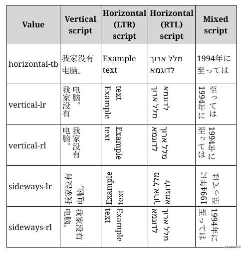

# CSS3 文本效果

## `word-wrap: break-word;`

强制单词换行，遇到长单词会直接切割。

## text-overflow

可选值为`clip`或`ellipsis`，用于控制单行文本超出的部分如何显示（直接溢出或者替换省略号）。
使单行文本自动换行的样式组合

```css
.target {
	text-overflow: ellipse;
	overflow: hidden;
	white-space: nowrap;
	/* 除了这三个元素外，overflow: hidden; 还需要通过 width 等手段限制该单行文本的最大长度 */
}
```

## text-shadow

接收参数：

1. h-shadow 必需。水平阴影的位置。允许负值。
2. v-shadow 必需。垂直阴影的位置。允许负值。
3. blur 可选。模糊距离。
4. color 可选。阴影的颜色。请参阅 CSS 颜色值。

## text-decoration

可选值：`overline | line-through | underline`，上划线|删除线|下划线。

## writing-mode

自定义文本在元素里的排列方式（如竖向排列，从右到左放置）



## user-select

控制用户选择，可通过设置 none 限制用户选择
