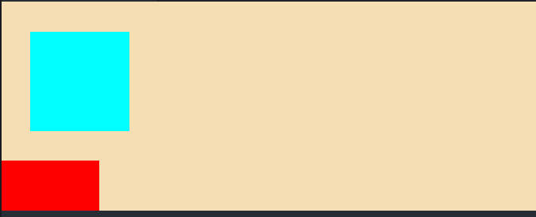
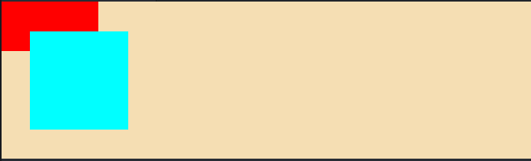

<!-- imageRoot:css -->

# 盒模型

<!-- TOC -->

-   [盒模型](#盒模型)
    -   [IE 盒模型](#ie盒模型)
    -   [W3C 标注模型](#w3c标注模型)
    -   [box-sizing 属性](#box-sizing属性)
    -   [float 浮动](#float-浮动)
        -   [清除浮动的方法](#清除浮动的方法)
    -   [BFC 规范](#bfc规范)
        -   [BFC 形成条件](#bfc形成条件)
        -   [BFC 特性](#bfc-特性)

<!-- /TOC -->

从外层到内层依次`margin`、`border`、`padding`、`content`组成的嵌套模型，大致分为两种：

## IE 盒模型

IE 的 content 部分包含了 border 和 padding，height 属性也包含这两部分;

## W3C 标注模型

即为标准盒模型。

## box-sizing 属性

设置一个盒的宽度设置方式，若为`content-box`（默认），设置的宽度为盒子的 content 部分的宽度，盒子的实际宽度将会加上 padding 和 border；若为`border-box`，设置的宽度为 border+padding+content 的宽度，实际 content 的内容宽度将减去那两部分。

高度同理。

## float 浮动

`float: left | right;`，将元素脱离文档流靠向 X 轴的左侧或者右侧，脱离文档流的元素将与同父元素内部的非浮动子元素产生重叠（文字将会自动环绕），同样浮动的元素会依次排列，排列不下的将自动换行。由于浮动元素脱离文档流，其内容及 margin 高度将不计入父元素的高度计算。

```html
<!-- html -->
<div class="outer" style="background: wheat;">
	<div class="inner f" style="background: aqua;"></div>
	<div class="inner s" style="background: red;"></div>
</div>
```

```css
/* css */
body {
	margin: 0;
	padding: 0;
}
.outer {
}
.inner {
	width: 100px;
	height: 100px;
}
.f {
	margin: 30px;
	float: left;
}
.s {
	height: 50px;
}
```

浮动效果：


### 清除浮动的方法

-   `clear: left | right | both;`

在需要清除浮动影响的元素（通常是浮动元素之后的第一个）中设置该属性，可设置该元素的对应方向不应存在浮动元素，若存在则自动下移，同时由于该元素的自动下移，以及该元素还在父元素的文档流中，因此浮动元素的体积即 margin 将计入父元素高度。

```css
/* 其他代码一致 */
.s {
	height: 50px;
	clear: both;
}
```

clear 清除浮动：


-   将父元素设置为 BFC 块

该设置会使得父元素计算高度时计入浮动元素的高度及 margin，但不会解决内部浮动元素以及非浮动元素的重叠问题。

```css
/* 其他代码保持一致 */
.outer {
	height: 100%;
	overflow: auto;
}
```

BFC 清除浮动：


## BFC 规范

BFC（Block Formatting Context）格式化上下文，是 Web 页面中盒模型布局的 CSS 渲染模式，指一个独立的渲染区域或者说是一个隔离的独立容器

### BFC 形成条件

1. 浮动元素，float 除 none 以外的值；
2. 定位元素，position（absolute，fixed）；
3. display 为以下其中之一的值 inline-block, table-cell, table-caption, flex, inline-flex；
4. overflow 除了 visible 以外的值（hidden，auto，scroll）；

### BFC 特性

1. 内部的 Box 会在垂直方向上一个接一个的放置。
2. 垂直方向上的距离由 margin 决定
3. bfc 的区域不会与 float 的元素区域重叠。
4. 计算 bfc 的高度时，浮动元素也参与计算
5. bfc 就是页面上的一个独立容器，容器里面的子元素不会影响外面元素。
