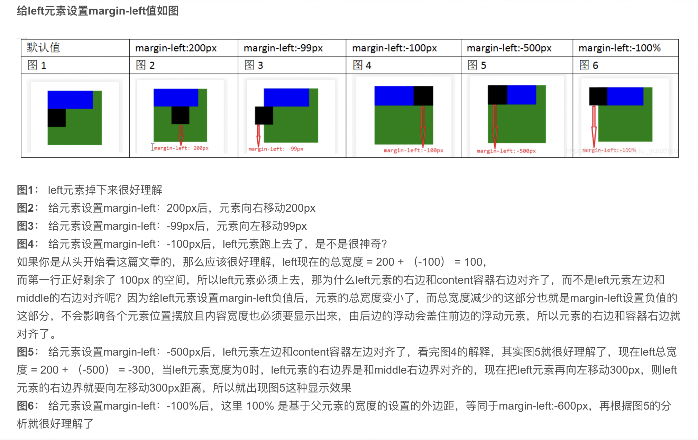
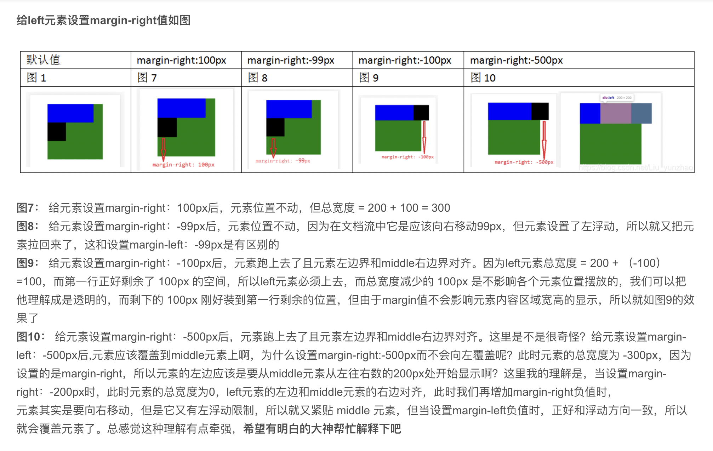

# 盒模型

从外层到内层依次`margin`、`border`、`padding`、`content`组成的嵌套模型，大致分为两种：

## IE 盒模型

IE 的 content 部分包含了 border 和 padding，height 属性也包含这两部分;

## W3C 标注模型

即为标准盒模型。

## box-sizing 属性

设置一个盒的宽度设置方式，若为`content-box`（默认），设置的宽度为盒子的 content 部分的宽度，盒子的实际宽度将会加上 padding 和 border；若为`border-box`，设置的宽度为 border+padding+content 的宽度，实际 content 的内容宽度将减去那两部分。

高度同理。

## float 浮动

`float: left | right;`，将元素脱离文档流靠向 X 轴的左侧或者右侧，脱离文档流的元素将与同父元素内部的非浮动子元素产生重叠（文字将会自动环绕），同样浮动的元素会依次排列，排列不下的将自动换行。由于浮动元素脱离文档流，其内容及 margin 高度将不计入父元素的高度计算。

```html
<!-- html -->
<div class="outer" style="background: wheat;">
	<div class="inner f" style="background: aqua;"></div>
	<div class="inner s" style="background: red;"></div>
</div>
```

```css
/* css */
body {
	margin: 0;
	padding: 0;
}
.outer {
}
.inner {
	width: 100px;
	height: 100px;
}
.f {
	margin: 30px;
	float: left;
}
.s {
	height: 50px;
}
```

浮动效果：


### 清除浮动的方法

-   `clear: left | right | both;`

在需要清除浮动影响的元素（通常是浮动元素之后的第一个）中设置该属性，可设置该元素的对应方向不应存在浮动元素，若存在则自动下移，同时由于该元素的自动下移，以及该元素还在父元素的文档流中，因此浮动元素的体积即 margin 将计入父元素高度。

**也可通过父元素的after来清除浮动**

```css
/* 其他代码一致 */
.s {
	height: 50px;
	clear: both;
}
```

clear 清除浮动：


-   将父元素设置为 BFC 块

该设置会使得父元素计算高度时计入浮动元素的高度及 margin，但不会解决内部浮动元素以及非浮动元素的重叠问题。

```css
/* 其他代码保持一致 */
.outer {
	height: 100%;
	overflow: auto;
}
```

BFC 清除浮动：


### 基于浮动的排版

同一方向的浮动元素默认会排成一行，若`宽度超过了父元素则自动换行`。

#### 浮动元素的margin

-   当元素的浮动方向和margin的方向相同时，该元素可以覆盖或远离上一个浮动元素。
-   当元素的浮动方向和margin的方向相反时，该元素不能覆盖上一个浮动元素，最近只能紧贴上一个元素右边。

[解析实例](https://blog.csdn.net/Liu_yunzhao/article/details/103976547)





#### 圣杯布局

利用浮动进行自适应布局的经典方案

主要实现过程

1.   中间栏设置width100%表示跟父元素同宽，以此自适应。
2.   三个元素都同向float，此时他们是属于同一行的，不过由于中间栏`width: 100%`他们会被挤成3行。
3.   通过margin将元素左移，让他们总宽度等于父元素，他们会排在一排但由于显示宽度导致后元素覆盖前元素。
4.   对于left和right使用`position: relative`使其可以展示。此时虽然覆盖情况被消除但是left和right会被挤到父元素外部。
5.   父元素设置margin或padding，将center挤小，此时布局完成。

圣杯布局的特点。

1.   不需要额外节点
2.   屏幕宽度过小会导致布局混乱。
3.   圣杯布局需要设置body的最小宽度，否则在middle元素小于left元素宽度时，布局会混乱。

```css
 body {
     min-width: 600px;
 }
```

```html
<!DOCTYPE html>
<html lang="en">
  <head>
    <meta charset="UTF-8" />
    <meta http-equiv="X-UA-Compatible" content="IE=edge" />
    <meta name="viewport" content="width=device-width, initial-scale=1.0" />
    <title>Document</title>
    <style>
      .header {
        height: 40px;
        background: lightblue;
      }
      .footer {
        height: 100px;
        background: lightcoral;
      }
      .main {
        margin: 0 300px 0 200px; /*挤压父元素，使center宽度正常*/
      }
      .center {
        width: 100%; /* 中间栏设置width100%表示跟父元素同宽，以此自适应 */
        height: 500px;
        margin-left: -200px; /*通过margin将元素左移，让他们总宽度等于父元素，他们会排在一排但由于显示宽度导致后元素覆盖前元素*/
        float: left; /*三个元素均浮动，因此他们在文档流上是一行的*/
        background: lightgray;
      }
      .left {
        width: 200px;
        height: 500px;
        float: left;
        background: lightpink;
        position: relative; /* 通过相对定位将每个元素显示出来*/
        left: -200px;
      }
      .right {
        width: 300px;
        height: 500px;
        float: left;
        margin-left: -300px;
        background: lightgreen;
        position: relative;
        right: -300px;
      }
      .clearfix::after {
        content: "";
        display: block;
        clear: both;
      }
    </style>
  </head>
  <body>
    <div class="header">头部</div>
    <div class="main clearfix">
      <div class="left">左列定宽</div>
      <div class="center">中间自适应</div>
      <div class="right">右列定宽</div>
    </div>
    <div class="footer">底部</div>
  </body>
</html>
```

#### 双飞翼布局

同样是利用浮动布局。双飞翼布局和圣杯实现思路前面部分是相同的

实现

1.   与圣杯一致
2.   与圣杯一致
3.   与圣杯一致
4.   双飞燕没有采用圣杯的方案，通过挤压center然后对left，right进行位移实现布局，而是`直接让left和right在前三步中覆盖center的左右两侧，然后center中增加一层节点center-wrap空出左右两个位置。最后将center真正的内容放到center-wrap中`。


特点：

1.   优先渲染主内容区域，通用性强，不需要设置body最小宽度。
2.   需要多一个元素节点。

```html
<!DOCTYPE html>
<html lang="en">
  <head>
    <meta charset="UTF-8" />
    <meta http-equiv="X-UA-Compatible" content="IE=edge" />
    <meta name="viewport" content="width=device-width, initial-scale=1.0" />
    <title>Document</title>
    <style>
      .header {
        height: 40px;
        background: lightblue;
      }
      .footer {
        height: 100px;
        background: lightcoral;
      }
      .center {
        width: 100%;
        height: 500px;
        float: left;
        background: lightgray;
      }
      .center-wrap {
        margin: 0 300px 0 200px;
        height: 500px;
        background-color: purple;
      }
      .left {
        width: 200px;
        margin-left: -100%;
        float: left;
        background: lightpink;
      }
      .right {
        width: 300px;
        height: 500px;
        float: left;
        margin-left: -300px;
        background: lightgreen;
      }
      .clearfix::after {
        content: "";
        display: block;
        clear: both;
      }
    </style>
  </head>
  <body>
    <div class="header">头部</div>
    <div class="main clearfix">
      <div class="center">
        <div class="center-wrap">中间自适应</div>
      </div>
      <div class="left">左列定宽</div>
      <div class="right">右列定宽</div>
    </div>
    <div class="footer">底部</div>
  </body>
</html>
```

## BFC 规范

BFC（Block Formatting Context）格式化上下文，是 Web 页面中盒模型布局的 CSS 渲染模式，指一个独立的渲染区域或者说是一个隔离的独立容器

### BFC 形成条件

1. 浮动元素，float 除 none 以外的值；
2. 定位元素，position（absolute，fixed）；
3. display 为以下其中之一的值 inline-block, table-cell, table-caption, flex, inline-flex；
4. overflow 除了 visible 以外的值（hidden，auto，scroll）；

### BFC 特性

1. 内部的 Box 会在垂直方向上一个接一个的放置。
2. 垂直方向上的距离由 margin 决定
3. bfc 的区域不会与 float 的元素区域重叠。
4. 计算 bfc 的高度时，浮动元素也参与计算
5. bfc 就是页面上的一个独立容器，容器里面的子元素不会影响外面元素。
