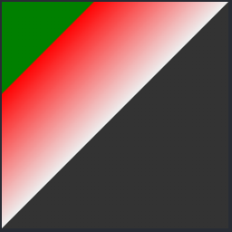
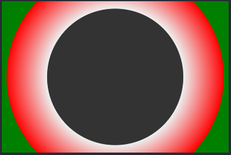

<!-- imageRoot:css -->

# css3 背景渐变色

```html
<style>
	.linear {
		margin: 0 auto;
		width: 200px;
		height: 200px;
		background: linear-gradient(to left top, #333 50%, #eee 50%, red 80%, red 80%, green 80%);
	}
</style>
<div class="linear"></div>
```



第一个参数可选，为方向或角度，后面的参数指定渐变的颜色与渐变的点。
方向的可选参数：to top/right/left/bottom/角度(如 90deg)。

## 重复的线性渐变：`repeating-linear-gradient`

## 径向渐变 `radial-gradient`

```html
<style>
	.linear {
		margin: 0 auto;
		width: 300px;
		height: 200px;
		background: radial-gradient(circle, #333 50%, #eee 50%, red 80%, red 80%, green 80%);
	}
</style>
<div class="linear"></div>
```

形状可选 circle 或 ellipse，默认为椭圆 ellipse



## 重复的径向渐变 `repeating-radial-gradient`
