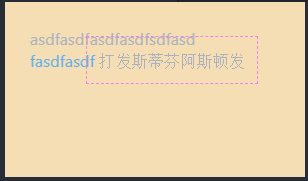

# CSS3 边框特效

## border-radius 圆角边框

border-radius 为简写属性，实际代表的四个属性：

1. border-top-left-radius
2. border-top-right-radius
3. border-bottom-right-radius
4. border-bottom-left-radius

以上四个属性可接收单值也可接收双值，若接收单值，则该值为边界圆的半径；`若接收双值，则值1为椭圆x方向半轴长，值2为y方向的半轴长。`

border-radius 语法实例：

```css
border-radius: 30px; /*四角均为30px半径的圆角*/
border-radius: 25% 10%; /*左上及右下为25%半径圆角，右上及左下为10%半径圆角*/
border-radius: 10% 30% 50%; /*依次为左上、右上及左下、右下*/
border-radius: 10% 30% 50% 70%; /*依次为左上、右上、右下、左下*/
```

当表达式中出现`'/'`时：

```css
border-radius: 1em/5em;
/* 等价于： */
border-top-left-radius: 1em 5em;
border-top-right-radius: 1em 5em;
border-bottom-right-radius: 1em 5em;
border-bottom-left-radius: 1em 5em;

border-radius: 4px 3px 6px / 2px 4px;
/* 等价于： */
border-top-left-radius: 4px 2px;
border-top-right-radius: 3px 4px;
border-bottom-right-radius: 6px 2px;
border-bottom-left-radius: 3px 4px;
```

`'/'`号前后为两组语法，分别匹配四个角的 x 方向及 y 方向。

## box-shadow 边框阴影

`box-shadow: h-shadow v-shadow blur spread color inset;`

box-shadow 接收六个值：

1. h-shadow 必需。水平阴影的位置。允许负值。
2. v-shadow 必需。垂直阴影的位置。允许负值。
3. blur 可选。模糊距离。
4. spread 可选。阴影的尺寸。
5. color 可选。阴影的颜色。请参阅 CSS 颜色值。
6. inset 可选。将外部阴影 (outset) 改为内部阴影。

## border-image 特效边框

覆盖 border 属性中设置的 color 属性，使得可以实现多色的边框。（也可以用 url 使用现成的图片）

1. border-image-source：用在边框的图片的路径。
2. border-image-slice：图片边框向内偏移。
3. border-image-width：图片边框的宽度。
4. border-image-outset：边框图像区域超出边框的量。
5. border-image-repeat：图像边框是否应平铺(repeated)、铺满(rounded)或拉伸(stretched)。

默认值：`'border-image: none 100% 1 0 stretch;'`

## outline-offset 轮廓位置

设置轮廓线距离元素实际边界的距离（向外）。

实例：

```html
<div class="outer" style="background: wheat;">
	<div>asdfasdfasdfasdfsdfasd</div>
	<a>fasdfasdf</a>
	<span>打发斯蒂芬阿斯顿发</span>
</div>
```

```css
.outer {
	height: 100px;
	overflow: auto;
	width: 200px;
	padding: 20px;
	box-sizing: content-box;
}
.outer span {
	outline-offset: 10px;
	/* 
    outline-style: dashed;
    outline-color: violet;
    outline-width: 1px; 
    */
	outline: violet dashed 1px;
}
```

样式：

## background-\* 背景显示

### background-clip 背景显示区域

background-clip 属性用于确定背景画区，有以下几种可能的属性：

1. `background-clip: border-box;` 背景从 border 开始显示
2. `background-clip: padding-box;` 背景从 padding 开始显示
3. `background-clip: content-box;` 背景显 content 区域开始显示
4. `background-clip: no-clip;` 默认属性，等同于 border-box

通常情况，背景都是覆盖整个元素的，利用这个属性可以设定背景颜色或图片的覆盖范围。

### background-origin 背景的位置

用于确定背景的位置，它通常与 background-position 联合使用，可以从 border、padding、content 来计算 background-position（就像 background-clip）。

1. `background-origin: border-box;` 从 border 开始计算 background-position
2. `background-origin: padding-box;` 从 padding 开始计算 background-position
3. `background-origin: content-box;` 从 content 开始计算 background-position

#### background-position 背景图片的位置

```css
/* 关键字 */
background-position: top | bottom | left | right | center;

/* 百分比 */
background-position: 25% 75%;

/* 长度值 */
background-position: 0 0;
background-position: 1cm 2cm;
background-position: 10ch 8em;

/* 多张背景图时，以逗号分开依次匹配 */
background-position: 0 0, center;

/* 以边界为基点偏移（例中bottom与right为边界，另两值即为以边界为基础反向偏移） */
background-position: bottom 10px right 20px;
background-position: right 3em bottom 10px;
background-position: bottom 10px right;
background-position: top right 10px;

/* 全局值 */
background-position: inherit;
background-position: initial;
background-position: unset;
```

```css
background-image: url('https://developer.mozilla.org/samples/cssref/images/startransparent.gif'),
	url('https://mdn.mozillademos.org/files/7693/catfront.png');
background-position: 0px 0px, center;
```

1. 关键字 center，用来居中背景图片。
2. 关键字 top, left, bottom, right 中的一个。用来指定把这个项目（原文为 item）放在哪一个边缘。另一个维度被设置成 50%，所以这个项目（原文为 item）被放在指定边缘的中间位置。
3. `<length>` 或 `<percentage>`。指定相对于左边缘的 x 坐标，y 坐标被设置成 50%。
4. 如果一个值是 top 或 bottom，那么另一个值不应该是 top 或 bottom。
5. 如果一个值是 left 或 right，那么另一个值不应该是 left 或 right 。
6. +50px（将图片的左边界对齐容器的中线）
7. 0px（图片的左边界与容器左边界重合）
8. -100px（将图片相对容器左移 100px，这意味着图片中部的 100px 内容将出现在容器中）
9. -200px（将图片相对容器左移 200px，这意味着图片右部分的 100px 内容将出现在容器中）
10. -250px（将图片相对容器左移 250px，这意味着图片的右边界对齐容器的中线）
11. 百分比值的偏移指定图片的相对位置和容器的相对位置重合。值 0%代表图片的左边界（或上边界）和容器的左边界（上边界）重合。值 100%代表图片的右边界（或下边界）和容器的右边界（或下边界）重合。值 50%则代表图片的中点和容器的中点重合。

### background-size 背景大小

background-size 属性常用来调整背景图片的大小，主要用于设定图片本身。有以下可能的属性：

1. background-size: contain; 缩小图片以适合元素（维持像素长宽比）
2. background-size: cover; 扩展元素以填补元素（维持像素长宽比）
3. background-size: 100px 100px; 缩小图片至指定的大小
4. background-size: 50% 100%; 缩小图片至指定的大小，百分比是相对包含元素的尺寸。

### background-break 背景跨盒显示

CSS3 中，元素可以被分成几个独立的盒子（如使内联元素 span 跨越多行），background-break 属性用来控制背景怎样在这些不同的盒子中显示。

1. background-break: continuous; 默认值。忽略盒之间的距离（也就是像元素没有分成多个盒子，依然是一个整体一样）
2. background-break: bounding-box; 把盒之间的距离计算在内；
3. background-break: each-box; 为每个盒子单独重绘背景。
