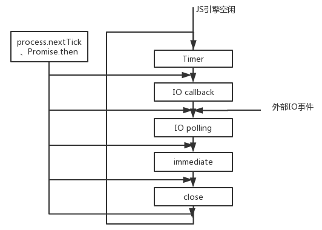

<!-- imageRoot:javascript -->

# JS 事件队列

<!-- TOC -->

-   [JS 事件队列](#js事件队列)
    -   [事件队列流程](#事件队列流程)
    -   [代码示例](#代码示例)
        -   [示例 1](#示例1)
        -   [示例 2](#示例2)
        -   [示例 3](#示例3)
        -   [示例 4](#示例4)

<!-- /TOC -->

<style>
img{
    width: 70%;
    padding-left: 15%;
}
</style>

## 事件队列流程



## 代码示例

### 示例 1

```javascript
setImmediate((/* 回调1 */) => {
	console.log(1);
	setTimeout(() => {
		console.log(2);
	}, 100);
	setImmediate(() => {
		console.log(3);
	});
	process.nextTick(() => {
		console.log(4);
	});
});
process.nextTick((/* 回调2 */) => {
	console.log(5);
	setTimeout(() => {
		console.log(6);
	}, 100);
	setImmediate(() => {
		console.log(7);
	});
	process.nextTick(() => {
		console.log(8);
	});
});
console.log(9);
/*输出
9
5
8
1
7
4
3
6
2
*/
```

输出解析：

-   将回调 1 放入 immediate 队列，将回调 2 放入 microTask 队列，输出：9。
    -   主线程结束，清空 microTask 队列，执行回调 2，输出：5；延时 100ms 将 6 放入 timer 队列，将 7 放入 immediate 队列（与回调 1 同轮），将 8 放入 microTask 队列。
        -   切换阶段，先清空 microTask 队列，输出：8。
-   切换阶段至 timer，由于不足 100ms，timer 为空。
-   切换至 immediate 阶段，内容为回调 1 和数字 7，执行回调 1，输出：1；延时 100ms 将 2 放入 timer 队列，将 3 放入下一轮 immediate 队列，将 4 放入 microTask 队列。
-   immediate 中还有 7，执行输出：7。
    -   切换阶段，先清空 microTask 队列，输出：4。
-   切换至 timer，未满 100ms，timer 为空。
-   切换至 immediate，输出：3。
-   等待满足时间后，6、2 依次放入 timer 队列，先后输出：6、2。

### 示例 2

```javascript
const fs = require('fs');
const promise = Promise.resolve();

fs.readFile('testjs.js', () => {
	console.log('file');
	setTimeout(() => {
		console.log('timeout1');
		setTimeout(() => {
			console.log('timeout2');
		}, 0);
	}, 0);
	setImmediate(() => {
		console.log('immediate1');
		setImmediate(() => {
			console.log('immediate2');
		});
	});
	promise.then(() => {
		console.log('promise1');
	});
	process.nextTick(() => {
		console.log('nextTick1');
	});
});
setTimeout(() => {
	console.log('timeout3');
	setTimeout(() => {
		console.log('timeout4');
	}, 0);
}, 0);
setImmediate(() => {
	console.log('immediate3');
	setImmediate(() => {
		console.log('immediate4');
	});
});
promise.then(() => {
	console.log('promise2');
});
process.nextTick(() => {
	console.log('nextTick2');
});
/*输出
nextTick2
promise2
timeout3
immediate3
timeout4//timeout4和immediate4顺序不定
immediate4//
file
nextTick1
promise1
immediate1
timeout1
immediate2
timeout2
*/
```

输出解析：

-   执行主线程，readFile、将 timeout3 加入 timer 队列，immediate3 加入 immediate 队列，将 promise2、nextTick2 加入 microTask 队列。
    -   切换阶段，清空 microTask 队列，其中`nextTick2`优先级更高，然后是`promise2`。
-   进入 timer 阶段，执行`timeout3`，将 timeout4 加入下一轮 timer 队列。
-   进入 immediate 阶段，执行`immediate3`，将 immediate4 加入下一轮 immediate 队列。
-   进入下一轮 timer 阶段，由于 setTimeout 强制的 1ms 时延，此时有两种情况：
    1. 加载本轮 timer 较慢，加载好时 timeout4 已经放入本轮的 timer 队列，即执行`timeout4`，然后变换阶段并执行`immediate4`。
    2. 加载本轮 timer 较快，加载好时 timeout4 还未放入 timer 队列，即跳过并执行`immediate4`，`timeout4`留到下一轮 timer 阶段执行。
-   IO 请求得到返回调用，输出`file`（当前阶段为 IO callback），将 timeout1 加入 timer 队列，将 immediate1 放入 immediate 队列，将 promise1 和 nextTick1 放入 microTask 队列。
    -   切换阶段，清空 microTask 队列，输出`nextTick1`，`promise1`。
-   切换阶段，由于之前在 IO callback 阶段，因此之后是 immediate 阶段，执行`immediate1`，将 immediate2 放入下一轮的 immediate 队列。
-   切换阶段至 timer，输出`timeout1`，将 timeout2 放入下一轮的 timer 队列。
-   切换阶段至 immediate，输出`immediate2`。
-   切换阶段至 timer，输出`timeout2`。

### 示例 3

利用事件队列方式在 js 文件中对 html 中引入并使用 jQuery

```javascript
let jq = document.createElement('script');
jq.type = 'text/javascript';
jq.src = 'jquery.js'; //jq文件路径
document.getElementsByTagName('head')[0].appendChild(jq);

setTimeout(() => {
	$(document).ready(() => {
		//do somethings
	});
}, 50);
```

在这种情况下，setTimeout 中的代码将会被放入 Timer 任务队列，等待 html 中直接引入的 js 代码执行完成后再开始检查回调队列。

### 示例 4

```html
<!-- index.html -->
<!DOCTYPE html>

<body>
	<script src="test.js"></script>
	<script src="test2.js"></script>
</body>
```

```javascript
//test.js
const jq = document.createElement('script');
jq.type = 'text/javascript';
jq.src = 'jquery-3.4.1.js';
document.getElementsByTagName('head')[0].appendChild(jq);

console.log('1');

setTimeout(() => {
	$(document).ready(() => {
		console.log('OK1');
	});
}, 50);
```

```javascript
//test2.js
console.log('2');

setTimeout(() => {
	$(document).ready(() => {
		console.log('OK2');
	});
}, 50);
```

页面加载结果：1,2,OK1,OK2
