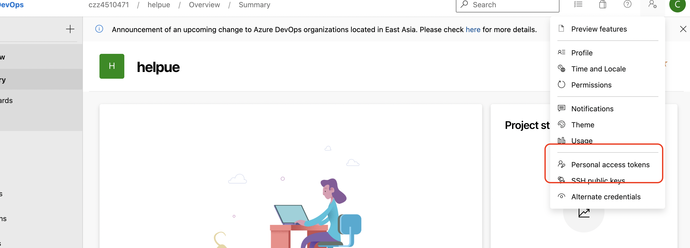

# VSCode 插件编写

## 开发及发布过程

### 新建项目

```sh
npm install -g yo generator-code yo code
yo code
```

### 发布项目

```sh
npm install -g vsce # 安装发布工具
vsce create-publisher publisher name # 创建发布人
```



```sh
vsce login # 登陆并输入获取的Token
vsce publish # 发布
```

## 通过 TS 解析语法树的 Vue 插件。

[helpue](https://github.com/czzczz/helpue)
